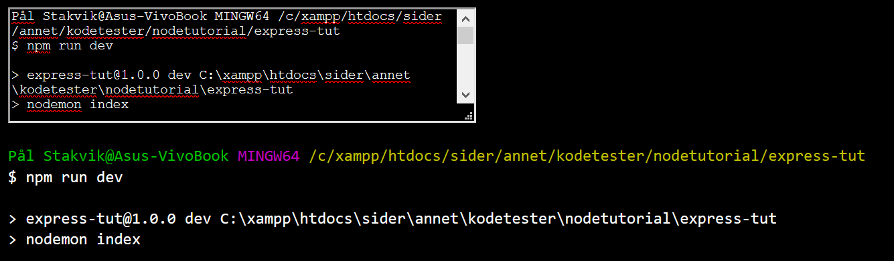
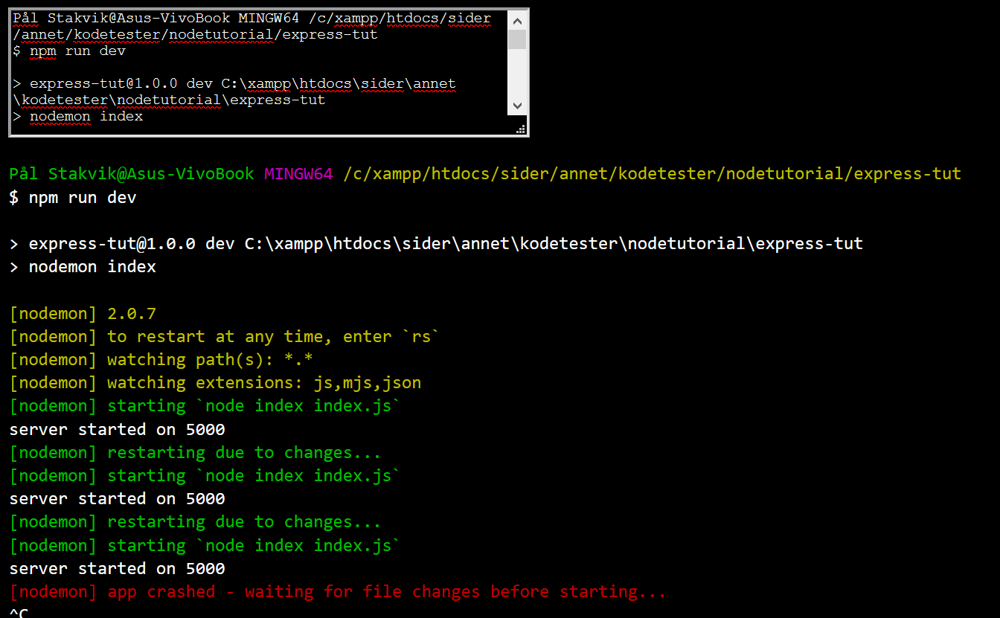

# Syntax highlighter for Git Bash


En webapp som visualiserer arkivert Git Bash-logg i opprinnelig syntax highlighting.

Når jeg gjennomfører en tutorial med bruk av Git Bash, liker jeg å ta vare på loggen slik at jeg kan bruke den som referanse senere. Jeg bruker ofte Visual Studio Code's innebygde terminal, men en ulempe med denne er at teksten mister farge når man kopierer og limer den inn i Word. For å få loggen til å bli mer leselig i ettertid, lagde jeg denne.

## Åpne nettside lokalt
### Installer
Clone repo og
```
npm install
```

### Serve
```
npm run start
```

Serve med Nodemon (for utvikling):

```
npm run dev
```
### Gå til
[localhost:5000](http://localhost:5000/)

## Eksempeltekst
```
<ditt OS brukernavn>@Asus-VivoBook MINGW64 /c/xampp/htdocs/sider/annet/kodetester/nodetutorial/express-tut
$ npm run dev

> express-tut@1.0.0 dev C:\xampp\htdocs\sider\annet\kodetester\nodetutorial\express-tut
> nodemon index

[nodemon] 2.0.7
[nodemon] to restart at any time, enter `rs`
[nodemon] watching path(s): *.*
[nodemon] watching extensions: js,mjs,json
[nodemon] starting `node index index.js`
server started on 5000
[nodemon] restarting due to changes...
[nodemon] starting `node index index.js`
server started on 5000
[nodemon] restarting due to changes...
[nodemon] starting `node index index.js`
server started on 5000
[nodemon] app crashed - waiting for file changes before starting...
^C
```

